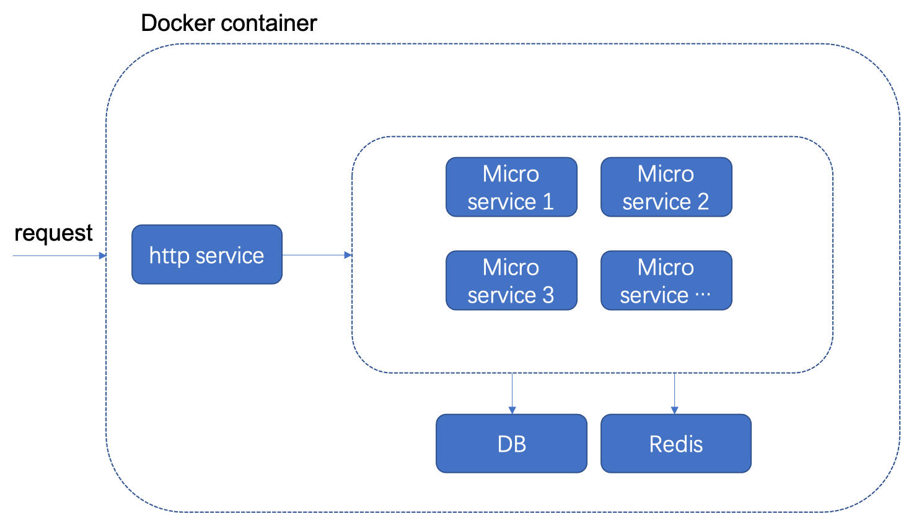

# MyLinux

## 1.Frame
### Here is a test to build a web frame.

 

## 2.Run web server
### how to run this web, go <a href="mysite/">here</a>

## 3.config and run redis-cluster
### Read this <a src="https://redis.io/topics/cluster-tutorial">page</a> to config redis-cluster. These config files saved in <a href="./redis-cluster">redis-cluster.</a>

RUN IN DOCKER TO DO...

